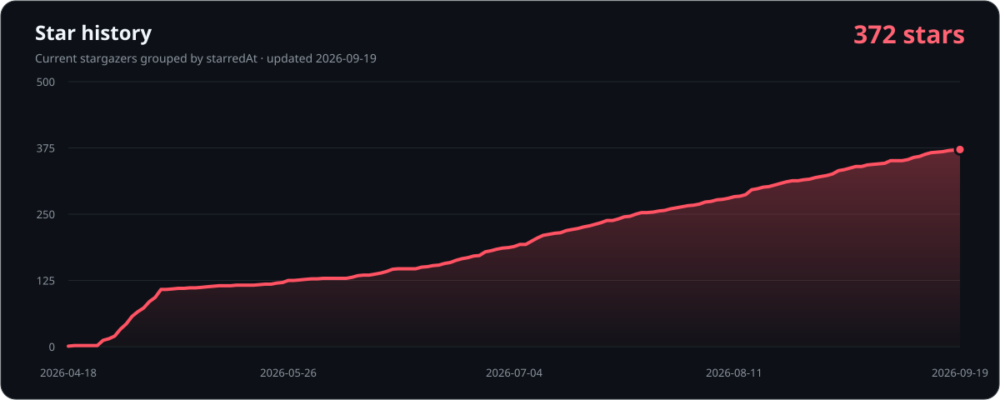

<p align="center">
  <a href="./README.md">繁體中文</a> · <strong>简体中文</strong> · <a href="./README.en.md">English</a> · <a href="./README.ja.md">日本語</a>
</p>

<h1 align="center">UAV Downloader</h1>

<p align="center">
  面向 JableTV、MissAV、SupJav、Hanime1 的桌面下载器与自动监控工具，内置 <strong>AI 生成字幕</strong>。<br />
  <strong>视频下载完成后自动添加 AI 字幕：</strong>日语音轨在本机识别，可输出日文、英文与繁体中文 SRT。<br />
  想自行浏览和选择视频，请使用 <strong>UAV Browser</strong>；想按分类持续追踪新内容，请使用 <strong>UAV Watcher</strong>。<br />
  <strong>真正的核心是无人值守：</strong>设置一次分类与计划任务，之后自动发现新片、跨站去重、下载并生成字幕。
</p>

<p align="center">
  <a href="https://github.com/Alos21750/UAV-Downloader/releases/latest"></a>
  <a href="https://github.com/Alos21750/UAV-Downloader/releases"></a>
  <a href="https://github.com/Alos21750/UAV-Downloader"></a>
  <a href="./LICENSE"></a>
  <a href="https://github.com/Alos21750/UAV-Downloader/pkgs/container/uav-downloader"></a>
</p>

<p align="center">
  <strong><a href="https://github.com/Alos21750/UAV-Downloader/releases/latest/download/UAV_Browser.exe">下载 UAV Browser</a></strong>
  ·
  <strong><a href="https://github.com/Alos21750/UAV-Downloader/releases/latest/download/UAV_Watcher.exe">下载 UAV Watcher</a></strong>
  ·
  <a href="https://github.com/Alos21750/UAV-Downloader/releases/latest">UAV Watcher portable ZIP（v3.1.0 起）</a>
  ·
  <a href="https://github.com/Alos21750/UAV-Downloader/releases/latest">查看最新版本</a>
</p>

> [!TIP]
> **默认完全在本机运行，无需 API Key，也不会上传内容。** UAV Browser 与 UAV Watcher 可在视频下载完成后自动建立播放器可切换的 `.ja.srt`、`.en.srt`、`.zh-TW.srt`，且不会修改 MP4。需要时也可自行接入常见 LLM API；云端模式只会发送识别后的字幕文字以及必要的 API 验证和常规连接信息，绝不会上传视频或音频。

<p align="center">
  
</p>

## 三种工作模式，一个下载核心

| 需求 | 建议 | 操作方式 |
|---|---|---|
| 浏览、搜索并逐个选择视频 | **UAV_Browser.exe** | 浏览视频卡片、多选、加入队列或立即下载 |
| 让电脑无人值守自动追新 | **UAV_Watcher.exe** | 选择网站、分类、日期、版本优先级与计划任务；之后自动扫描、去重、下载并生成字幕 |
| Defender 对单文件 UAV Watcher 报告检测 | **UAV_Watcher_portable.zip** | 先核对哈希和检测详情，再评估无需临时自解压的备用包；若备用包也被检测，请停止使用并报告 |
| 在 NAS／服务器上无界面运行 | **Docker / CLI** | 传入一个或多个网址，或挂载 `urls.txt` |

如果不确定，请先使用 **UAV Browser**。两个 Windows 可执行文件均无需安装 Python，Release 版本已经包含 ffmpeg。

深入了解：[UAV Browser](./docs/uav-browser.md) · [UAV Watcher 无人值守流程](./docs/uav-watcher.md) · [AI 字幕](./docs/ai-subtitles.md) · [Docker / CLI](./docs/docker-cli.md) · [升级至 UAV](./docs/migration-to-uav.md)

## Windows：30 秒开始

1. 下载 [UAV_Browser.exe](https://github.com/Alos21750/UAV-Downloader/releases/latest/download/UAV_Browser.exe) 或 [UAV_Watcher.exe](https://github.com/Alos21750/UAV-Downloader/releases/latest/download/UAV_Watcher.exe)。
2. 将文件放在可写入的文件夹中，双击运行。
3. 首次打开时选择语言；以后可随时切换简体中文、繁體中文、English、日本語以及浅色／深色主题。

SmartScreen 信誉警告和 Defender Antivirus 隔离是不同事件。请先阅读 [Windows 下载与安全验证](./WINDOWS_SECURITY.md)：核对 `SHA256SUMS.txt` 与 GitHub provenance；如果 Defender 显示威胁名称，请勿直接降低安全防护。

## UAV Browser：浏览、选择、下载

1. 在“浏览”中选择 JableTV、MissAV、SupJav 或 Hanime1，然后选择分类或输入关键词；Hanime1 另有可组合类型、排序、时间、时长与 240 个标签的完整筛选器。
2. 勾选多个视频后加入队列，或立即下载所选内容。
3. 也可在“下载”页粘贴网址，或从 `.txt` / `.csv` 导入多个网址。
4. 在“设置”中调整保存位置、画质、并发下载数、单片线程数、速度上限、AI 字幕和 Proxy。

| 功能 | 当前行为 |
|---|---|
| 下载队列 | 每项显示状态、进度和速度；队列会持久保存；进行中的任务可停止并优先重新排队，失败任务可单独重试 |
| 并发下载 | 默认同时下载 2 个视频，最多 32 个；AI 字幕使用独立后台队列，不占用视频下载名额 |
| 单片线程 | 每个视频的分段工作线程上限为 1–16，默认根据 CPU 自动计算（最高 16）；实际来源可能使用更少连接，SupJav／Hanime1 直连最多 4 条。使用 Proxy 时可调低以减轻负载 |
| 画质偏好 | 最高、1080p、720p、480p、360p、最低；实际可用画质取决于来源 |
| AI 字幕 | 关闭、日文、英文、繁体中文或三语；默认在本机翻译，也可自行配置 LLM API；输出为播放器可切换的同名 SRT |
| 网址操作 | 剪贴板检测、手动粘贴、文本／CSV 批量导入 |
| Proxy | 支持自定义 HTTP、HTTPS、SOCKS4、SOCKS5，或使用 Windows 已启用的手动 ProxyServer；不会修改 Windows 全局代理 |
| 更新 | 后台检查 GitHub Release，发现新版本后由用户确认更新 |

## UAV Watcher：按分类自动追踪新内容

<p align="center">
  
</p>

1. 选择保存位置；若留空，UAV Watcher 会在可执行文件旁自动建立 `tmp`。
2. 点击“显示设置”调整共同基准日期与文件夹，或为四个网站分别指定日期与保存位置；也可调整画质、单片线程、版本优先级、AI 字幕和 Proxy。
3. 在四个网站标签中搜索并勾选分类；支持整组全选。
4. 点击“计划”选择每 1–168 小时检查一次，或每天按本机时间在指定时刻检查。
5. 点击“开始监控”。分类会保持可见；仅在扫描或下载时显示进度，需要日志时点击“显示活动”。

| 网站 | 可选目标数 | 分组内容 |
|---|---:|---|
| JableTV | 129 | 动态／排行、主要分类和标签组 |
| MissAV | 102 | 动态／排行、分类／标签和厂商组 |
| SupJav | 10 | 动态／排行和主要分类 |
| Hanime1 | 272 | 上市／上传／排行、里番／泡面番等 9 种类型、6 种时间、8 种时长与完整 240 标签 |

UAV Watcher 可设置为每 1–168 小时自动检查，或每天按这台电脑的本地时间在指定时刻检查；旧设置仍默认为每 24 小时。点击“立即检查”会马上运行一次，不会建立重复计划。同一番号在不同分类或网站重复出现时，会优先保留符合用户版本偏好的候选项；无法可靠识别番号时仅按完全相同的网址去重，不会猜测合并。

下载记录优先保存在可执行文件旁的 `.uav-watcher`；如果该位置不可写，则改用 `%APPDATA%\UAV Downloader\watch`。

## AI 字幕：下载完成后自动添加日／英／繁中 SRT

- 两个 Windows GUI 均可在下载前选择 **关闭／日文／英文／繁体中文／三语**。视频完成后只会在旁边建立所选的 `.ja.srt`、`.en.srt`、`.zh-TW.srt`，不会修改原始 MP4。如果只要求英文或繁中而翻译失败，不会留下未选择的日文 sidecar。字幕翻译默认使用无需 API Key 的本机模式。
- 日语识别始终在本机执行。默认的 **自动（推荐）** 使用固定 revision 的 [ReazonSpeech K2 v2](https://huggingface.co/reazon-research/reazonspeech-k2-v2) 与 [sherpa-onnx](https://github.com/k2-fsa/sherpa-onnx)，针对普通 CPU 优化，无需独立显卡；经过 SHA-256 验证的识别包约 **178 MB**，仅在第一次实际需要字幕时下载。
- 原有 [whisper.cpp](https://github.com/ggml-org/whisper.cpp) 模式仍可明确选择：**精确 large-v3-turbo q5（约 574 MB）**、**平衡 small q5（约 190 MB）**、**快速 base q5（约 60 MB）**。自动模式仅在执行失败、输出损坏或时间轴结构无效时另行下载并切换到平衡模式；不会根据对文字质量的主观猜测自行切换。
- [官方 Silero VAD](https://huggingface.co/ggml-org/whisper-vad/tree/main) 只用作语音门控；识别使用保留原始静音、带上下文且互不重叠的窗口，再将结果映射回视频的绝对时间。ReazonSpeech 使用高效的 CPU RNN-T 解码；三个 Whisper 模式使用 beam search、best-of 和温度 fallback。
- App 会记录其生成字幕所用的识别 profile 与 pipeline 来源；两者发生变化时，会重新生成由 App 建立的字幕及其衍生翻译。没有来源记录的现有 SRT，或生成后由用户修改过的 SRT，会保持不变。
- 本机英文与台湾繁体中文翻译使用固定版本、经过 SHA-256 验证的 [FuguMT](https://huggingface.co/staka/fugumt-ja-en) 与 [OPUS-MT](https://huggingface.co/Helsinki-NLP/opus-mt-en-zh) INT8 小模型，不使用 Google 或其他免费网络翻译端点。本机翻译模型包约 **147 MB**，只有在实际开始生成英文、繁中或三语字幕时才下载；选择“关闭”或“日文”不会下载，改用 LLM API 时也无需该本机翻译包。下载一次后即可离线重复使用。
- 可选 API 扩展支持 **OpenAI、Anthropic、Gemini** 和 **OpenAI-compatible** API；兼容模式可连接 DeepSeek、OpenRouter、Groq、Ollama、LiteLLM 等服务。影音内容中只有识别后的字幕文字会发送到所选服务；API 验证和普通连接信息也会正常发送，但视频与音频始终保留在本机。
- 用户自行提供的 API Key 会通过 Windows DPAPI，使用当前登录的 Windows 帐号加密保存；项目与 EXE 不包含任何 API Key。各服务的价格、额度、数据处理和使用政策由相应供应商决定，使用前请自行确认。
- 本机翻译会让每个 cue 保持原有时间轴，并使用 900 多组由维护者编写和审核的成人语境、安全／同意、拍摄隐私、现场指示和日常短语，同时加入保守的台湾用语修正与版本化 exact-match 翻译记忆；不会使用可能颠倒“停／不要停”含义的模糊匹配。
- UAV Browser 的视频下载与字幕处理使用独立队列；字幕逐个在后台生成，不占用 1–32 个视频下载名额。
- 生成速度取决于 CPU、视频长度、实际语音比例和所选翻译服务；三语共用同一次本机语音识别。本机模式也会复用中间翻译结果，避免重复推理。

## 支持范围

| 网站 | UAV Browser 浏览／搜索／下载 | UAV Watcher 分类监控 | Docker／CLI 网址下载 |
|---|:---:|:---:|:---:|
| JableTV | ✓ | ✓ | ✓ |
| MissAV | ✓ | ✓ | ✓ |
| SupJav | ✓ | ✓ | ✓ |
| Hanime1 | ✓ | ✓ | ✓ |

网站和 CDN 可能随时调整；如果某个网站失效，请先确认正在使用最新版本，再附上可复现信息提交 Issue。

Hanime1 支持官方 `watch?v=` 网址、站内搜索、分页，以及可组合的排序、类型、上架时间、时长和完整 240 标签；里番／泡面番的精简列表版式也能正确解析。下载时会实时解析站方签名 MP4，按画质偏好选择可用来源，并支持最多 4 路分段、断线续传和单路备用。

## 从源代码运行

需要 **Python 3.10+** 与 Tk。旧 README 中的 Python 3.8+ 已不符合当前源代码的语法要求。

```bash
git clone https://github.com/Alos21750/UAV-Downloader.git
cd UAV-Downloader
python -m pip install -r requirements.txt
python -m pip install -e .

# 完整 GUI
uav-browser

# 分类自动监控工具
uav-watcher

# 单个网址、无 GUI，并指定保存位置与每片 3 个下载线程
uav-browser --nogui --url "https://jable.tv/videos/example/" --output "/path/to/downloads" --max-workers-per-video 3
```

`-o` 是 `--output` 的简写；若省略，默认保存在 `./download`。`--max-workers-per-video` 接受 1–16，可在 Proxy 负载较高时调低。

Linux 若未内置 Tk，请先通过系统包管理器安装 `python3-tk`。macOS／Linux 使用源代码运行；免安装 EXE 仅提供给 Windows。

## Docker / NAS

公开镜像为 `ghcr.io/alos21750/uav-downloader:latest`，GitHub Actions 会构建 amd64 和 arm64 版本。

```bash
# 下载单个网址；将主机文件夹挂载到 /downloads
docker run --rm -v "/path/to/downloads:/downloads" \
  ghcr.io/alos21750/uav-downloader:latest "https://jable.tv/videos/example/"

# docker compose：直接传入网址
docker compose run --rm uav "https://jable.tv/videos/example/"

# 或将网址逐行写入 ./downloads/urls.txt
docker compose run --rm uav
```

可用环境变量：

| 变量 | 用途 |
|---|---|
| `RESOLUTION` | `highest`、`1080`、`720`、`480`、`360`、`lowest` |
| `MAX_WORKERS_PER_VIDEO` | 每个视频的分段工作线程上限，范围 1–16；调低可减轻 Proxy 负载 |
| `URL` / `URLS` | 传入一个或多个网址 |
| `URLS_FILE` | 网址列表；默认为 `/downloads/urls.txt` |
| `DOWNLOAD_DIR` | 容器内保存位置；默认为 `/downloads` |

Docker 是无界面、执行完即退出的下载任务，不包含 UAV Browser 或 UAV Watcher GUI。

## 遇到问题

提交 [GitHub Issue](https://github.com/Alos21750/UAV-Downloader/issues/new) 时，请提供：

- App 版本、使用的工具和操作系统。
- 网站与可复现网址，以及预期／实际结果。
- 如果程序崩溃，请附上可执行文件旁的 `crash_log.txt` 或 `crash_native.log`。
- 不要上传 Cookie、Proxy 帐号密码、Token 或其他私密信息。

需要 Proxy 时，可在 UAV Browser“设置”或 UAV Watcher 顶部选择自定义代理、Windows 系统代理或禁用。两个 GUI 共用该设置，而且只作用于本程序；Windows 模式目前支持已启用的手动 ProxyServer。PAC 配置网址会被提示但不会执行，尚不支持 WPAD 自动检测。

## Stars 与项目活动

<p align="center">
  
</p>

图表由本仓库的 GitHub Actions 使用只读 repository token 取得当前 stargazer 的 `starredAt` 时间后生成；不会请求或输出帐号名称。只有数据或图表格式变化时才会更新。因此曲线表示“目前仍为仓库点 Star 的帐号”的加入日期；已经取消 Star 的帐号不包含在数据中。

<details>
<summary>为什么不再使用旧的 api.star-history.com 图片？</summary>

GitHub 在 2026 年 7 月限制了 stargazer 列表访问，导致旧的匿名 Star History 图片端点失效。本项目现在通过自己的 GitHub Actions 权限生成静态 SVG，既避免 README 出现失效图片，也不会把 Token 放入 README。参考：[GitHub 公告](https://github.blog/changelog/2026-06-30-upcoming-access-restrictions-to-public-api-endpoints-and-ui-views/) · [Star History 说明](https://www.star-history.com/blog/github-stargazer-api-restriction/)

</details>

## 许可证与使用责任

代码采用 [Apache License 2.0](./LICENSE)。本工具仅供合法的个人或研究用途；请遵守所在地法律、网站条款和内容权利，只下载您有权访问的内容。

版本变更与已解决的问题请查看 [Releases](https://github.com/Alos21750/UAV-Downloader/releases)。

<p align="center">由 <a href="https://github.com/Alos21750">ALOS</a> 构建和维护。</p>
